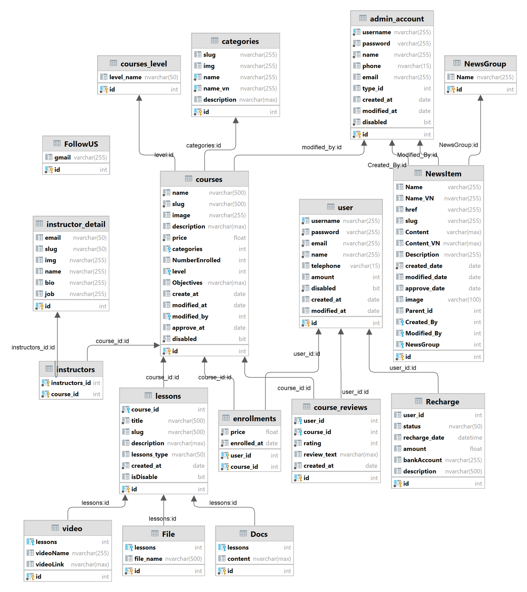

# Online Learning Website Using JSP/Servlet

This project is an online learning website developed using JSP/ Servlet. It provides a platform for users to access educational resources, participate in courses, and enhance their knowledge remotely.

## Contributor
- Nguyễn Tuấn Ninh
- Đào Quang Khải
- Nguyễn Quang Minh
- Nguyễn Tiến Giang
- Vũ Khánh Toàn
## Features

📚 Course Management:
- Users can browse through a catalog of courses offered.
- Course details are displayed, including descriptions, instructors, and enrollment information.
- Users can enroll in courses and learn this course.

📖 Learning Materials:
- Each course has a collection of learning materials such as videos, documents.
- Users can access and download these materials to support their learning.

📰 News Section:
- The website includes a dedicated section for news and updates related to the education industry.
- Users can read the latest news articles and stay informed about educational trends, advancements, and events.

📄 User Authentication and Profiles:
- Users can create accounts and log in securely.
- User profiles store personal information, enrollment history, and progress tracking.

⭐️ Course Ratings and Reviews:
- Users can provide ratings and reviews for the courses they have completed, helping others make informed decisions.

🔍 Search Functionality:
- Users can search for courses based on various criteria such as keywords, categories, and instructors.

🌐 Multi-language Support:
- The website supports multiple languages, allowing users to switch between different language options.

💰 Payment Integration:
- Users can make payments securely to enroll in premium courses or access additional learning materials.

📧 Email Notifications:
- The website can send email notifications to users for important updates, such as course enrollment confirmations, password resets, and new course releases.

🖥️ Data-driven Website Design:

- The website features a data-driven design approach, allowing administrators to dynamically change various elements of the website such as menus, banners, and the footer.
- Administrators can update menus to reflect changes in course categories or add new sections as needed.
- Banners and promotional content can be modified to highlight featured courses, events, or announcements.
The footer section can be customized with relevant information and links.

🔐 Login with Google Account:

- Users can log in to the website using their Google accounts.
- This feature provides a convenient and secure option for users to access the learning platform without the need to create separate login credentials.
- User authentication is performed through Google OAuth, ensuring the safety of user data.
## Technologies Used

The project utilizes the following technologies and tools:

- Java
- JSP/Servlet
- HTML/CSS/JavaScript
- Microsoft SQL Server
- Apache Tomcat
- Payment Gateway API (Casso)
- JavaMail API
- Google API
## How to Run the Project

1. Clone or download the project files from the repository.
2. Set up a servlet container (e.g., Apache Tomcat) on your local machine.
3. Import the project into your preferred IDE.
4. Configure the database connection settings in the project configuration files.
5. Run file data.sql to import data
6. Build and deploy the project to the servlet container.
6. Access the website using a web browser at the specified URL.

<b>Account:</b>
- Admin: admin1- admin
- Employee: admin2- admin
- User: tuanninh- password123, tiengiang- password132

## Database Schema

The website uses a relational database to store and manage data. Here is a simplified version of the database schema:

